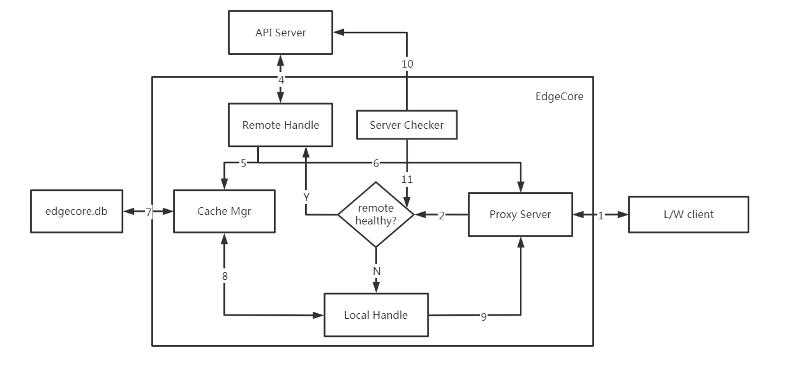
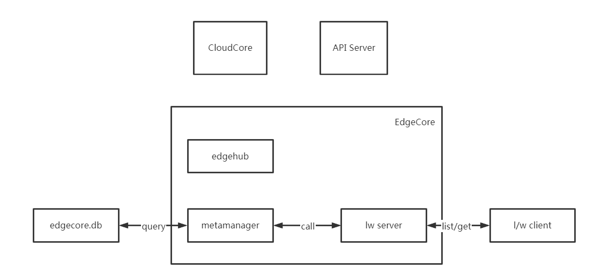
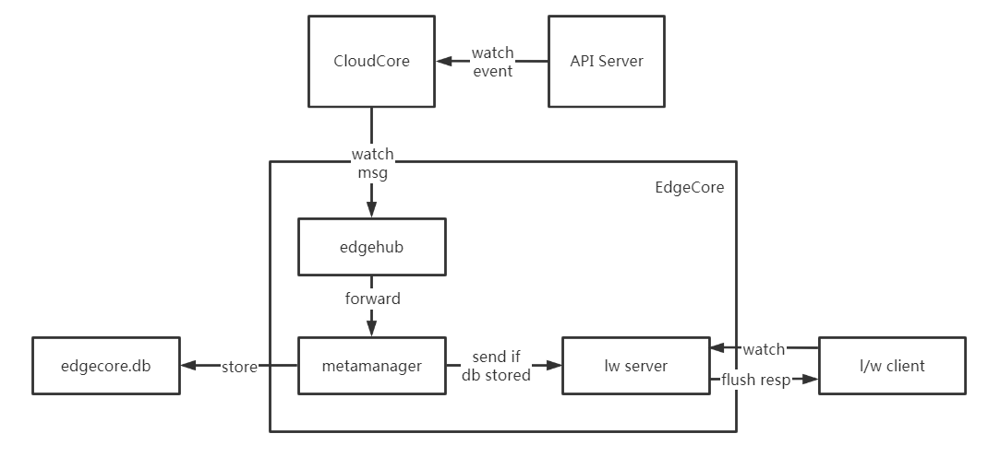
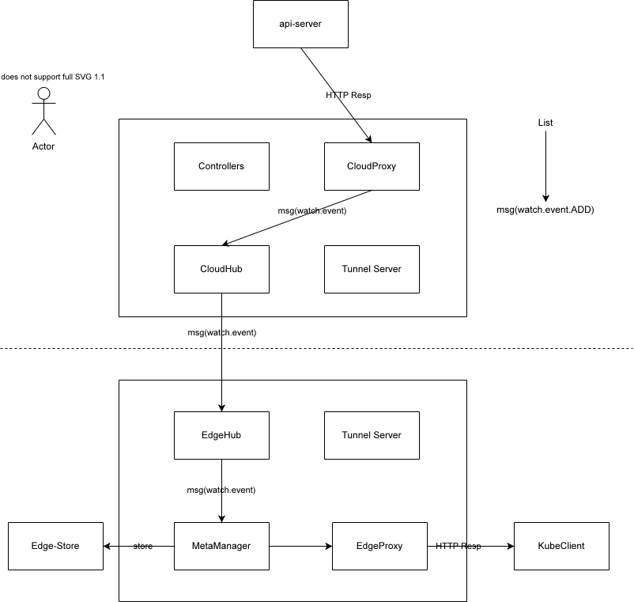

### API Server代理方式：

该方案整体是在EdgeCore上建立代理服务器（Proxy Server），通过代理服务器完成与API Server的通信。为了达到离线自治的目的，需要同时构建本地处理请求(Local Handle)和远程处理请求（Remote Handle）两种机制。远程处理请求时，将请求直接转发给API Server，但需要拦截请求结果，将请求结果再加工，response内容复制为两份，一份入缓存，一份返回客户端。本地处理请求时，直接访问本地缓存内数据。

##### 核心对象：

Proxy Server：http服务器，做List/Watch代理访问入口使用，默认端口为10005。主要用于根据Server Checker检查云端API Server是否可用来决定将请求转向Remote Proxy还是Local Proxy访问。

Remote Handle：API Server的代理服务器，将list/watch转发到云端API Server进行处理，拦截请求的响应结果，将结果返回给客户端的同时发送到本地缓存，构建缓存对象，供节点离线时使用。

Local Handle：本地代理服务器，在云端API Server不可访问时，本地自治服务，主要访问本地缓存内数据。

Server Checker：API Server检查器，周期性检查API Server是否可达，将API Server是否可达状态更新到ProxyServer内。

Cache Mgr：本地缓存管理器。主要用于构建和管理list/watch的本地缓存数据。

##### 工作流程：

过程及细节阐述：

- l/w client发送list/watch请求到edgecore的proxy server（路径1）
- proxy server判断api server服务是否可达（路径2）
- 如果API Server可访问，走路线Y，否则走路线N

API Server可达时

- RemoteHandle处理请求，将请求转发给APIServer，路径4
- 请求返回时，复制response内容，分别走路径5和6
- 达到路径5的数据，经过缓存管理器的处理，将结果缓存到edgecore.db内。
- 达到路径6的数据，直接返回给lw client。

API Server不可达时

- Local Handle处理请求

- - 如果是list请求，经路径8，通过Cache Mgr访问缓存，返回本地所有数据到l/w client（路径9）。

  - 如果是watch请求，直接返回结构，增加请求头：Transfer-Encoding:chunked，不会持续返回新的事件

    

远端服务器可访问时：

1->2->Y->4->6->1

​        ↓

​         5->7

远端服务器不可访问时：

1->2->N->8->7->8->9->1

API Server状态检查流程：

10->11

- 每隔5s主动探测一次API Server的healthz接口，探测结果进行保存，供Proxy Server使用

### 优缺点：

优点：

- 可在网络可达情况下支持lw client对特定资源对象的所有操作
- 与云端共用同一套认证系统，sa所产生的token信息直接转发云端认证
- 离线时构建缓存，基于http请求头的user agent，可做离线情况下简单的数据隔离
- crd支撑的时候，完成对crd响应结果的解析存储，以及离线情况下的数据序列化即可，相较于其他的方案，支持crd应该较为简单

缺点：

- edgeproxy与API Server直接通信，与当前边缘侧的服务通过CloudCore与API Server通信略有矛盾，整体与API Server通信不可统一管控
- 如果edgeproxy使用https，则需要对edgeproxy再签发一套基于apiserver ca的证书，整个kubeedge使用证书显得过于复杂；若不使用https，则需要将lw client使用http方式访问edge proxy，不能使用https【通病】

###  CloudCore消息分发方式：

该方案主要考虑充分复用边端数据。在边缘节点直接构造一个严格版API Server，可以处理l/w client发送过来的对资源对象的list/watch/get请求，将metaManager（edgecore.db）做为数据来源（k8s内etcd的角色）。

list/get请求处理流程：

watch请求处理流程：

##### 核心对象：

lw server：边缘侧API Server入口。主要用来接收边缘侧服务对k8s资源对象的list/watch/get请求。设计为edgecore的新的module。

工作流程：

list/get请求：

- 在l/w client发起list/get请求时，lwserver接收请求
- lw server通过metaclient访问本地edgecore.db内容，拼接lw client需要的数据

watch请求：

暂只考虑svc、ep、pod等部分内容

响应客户端

- l/w client向lw server发起watch请求
- lw server设置http分块传输的请求头，flush请求，for循环等待更新内容进入或者超时退出
- for循环内根据传递过来的请求，将内容转换为k8s watch event，flush给client

watch事件构建

- metamanager在收到edgehub传递过来的数据持久化存储之后，将数据同步传递到lwserver模块。
- lwserver模块根据消息内资源对象类型将数据分发给需要接受变更的watch请求。

##### 优缺点：

优点：

- 可复用以存在的pod，cofigmap等数据
- 避免暴露API Server相关信息，对云端k8s集群更加安全

缺点：

- 对edgecore.db内数据进行整理，以最小粒度存放，podlist和单独pod对象在构建最终返回给client列表时不友好
- l/w client需要筛选条件应需定制实现，无法复用云端API Server逻辑
- crd支持的话，需要云端进行数据的下发
- 对于边端的selector支持不好，得自己实现
- 对patch、update、delete操作都需要单独处理
- 认证部分问题无法解决，需要自己实现
- 与apiserver代理方式一样，存在证书认证问题

### 复用tunnel server方式：

相比于API Server代理方式，不直接与API Server通信，通过tunnel server将数据转发到云端，通过云端的服务完成与API Server通信。其他与API Server代理方式一致。

##### 优缺点：

优点：

- 边端服务对api server无感知
- 云端可以对API Server访问进行统一的限制管理

缺点：

- lw client的证书问题
- tunnel server当前逻辑和cloudhub耦合度高，后续有计划进行剥离，当前复用给后面增加剥离的负担？模块化耦合度过高？
- cloudcore增加逻辑？